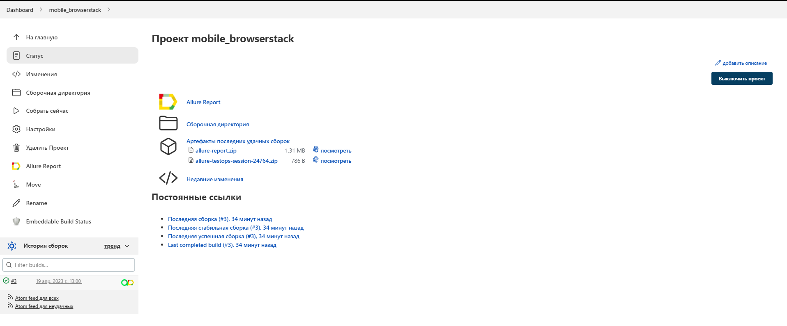
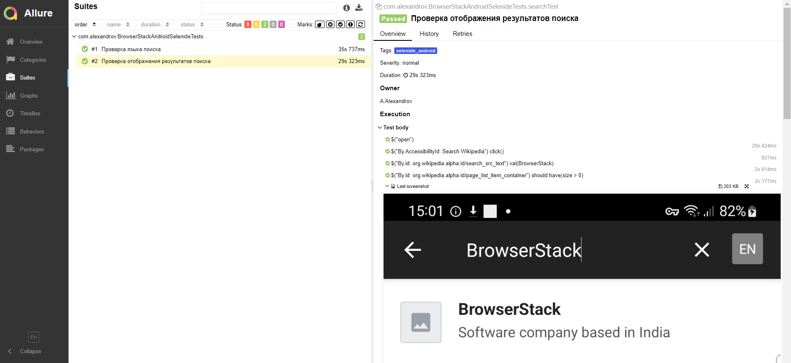
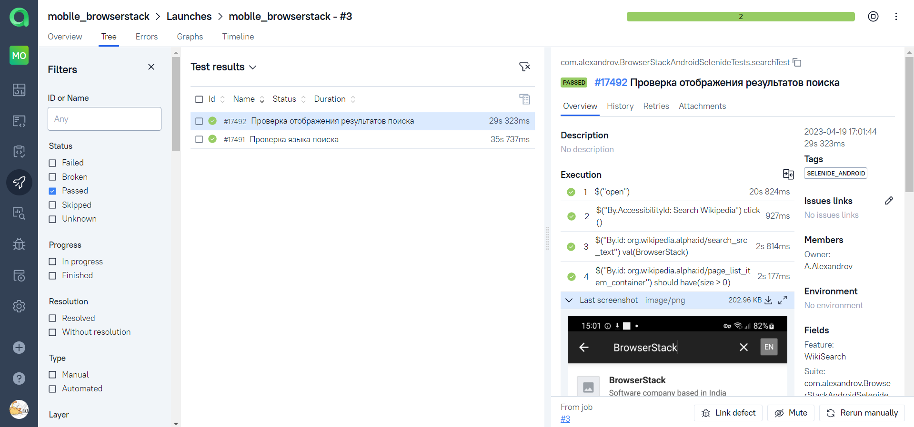
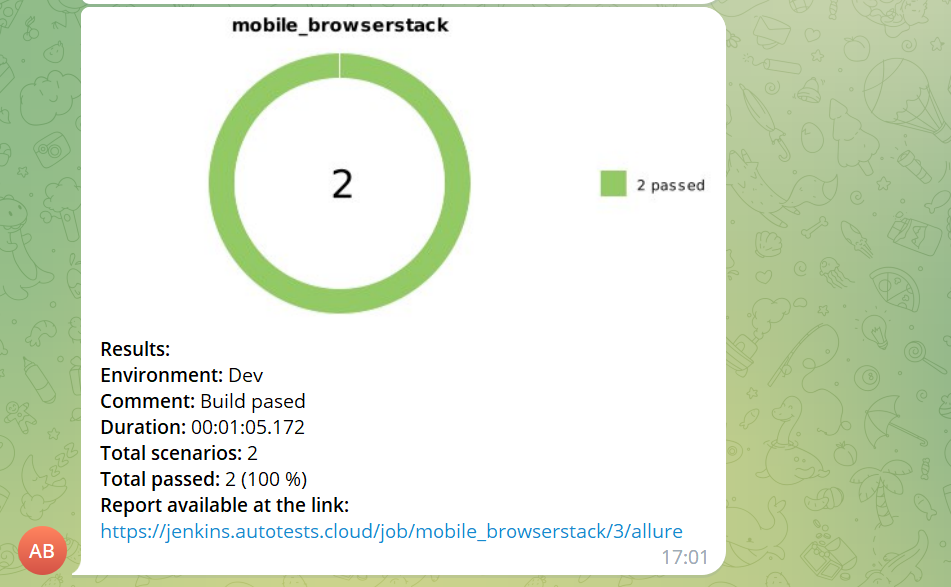
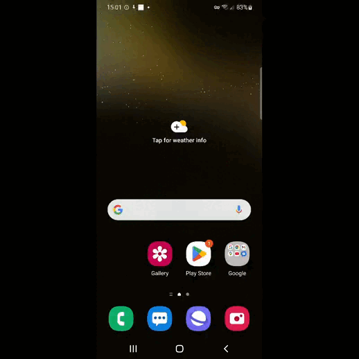

##  UI автотесты для Android приложения Wikipedia

## :computer: Использованный стек технологий

<p align="center">


</p>

## :running_woman: Варианты запуска тестов из терминала

### Для удаленного запуска с Browserstack:
```
./gradlew clean test -DdeviceHost=browserstack
```
### Для запуска на эмуляторе Android Studio:
```
./gradlew clean test -DdeviceHost=local
```
### Для запуска на локальном устройстве Android:
```
./gradlew clean test -DdeviceHost=real
```

##  Сборка в Jenkins
### <a target="_blank" href="https://jenkins.autotests.cloud/job/mobile_browserstack/">*Jenkins job*</a>

<p align="center">

</p>

##  Allure-отчет
### <a target="_blank" href="https://jenkins.autotests.cloud/job/mobile_browserstack/3/allure/#suites/64fbf7b5c40e21e96b63c268953d5ea5/6fedd44f40eb8f95/">*Overview*</a>

<p align="center">

</p>

##  Интеграция с Allure TestOps
### *Allure TestOps* <a target="_blank" href="https://allure.autotests.cloud/project/2198/dashboards">*Dashboard*</a>

<p align="center">  
  
</p> 

##  Уведомление в Telegram с использованием бота

После завершения сборки специальный бот, созданный в <code>Telegram</code>, автоматически отправляет сообщение с отчетом прохождения тестов.

<p align="center">

</p>

Для каждого теста выполняется запись видео. Ниже представлен пример видео прохождения теста.
<p align="center">
  
</p>
